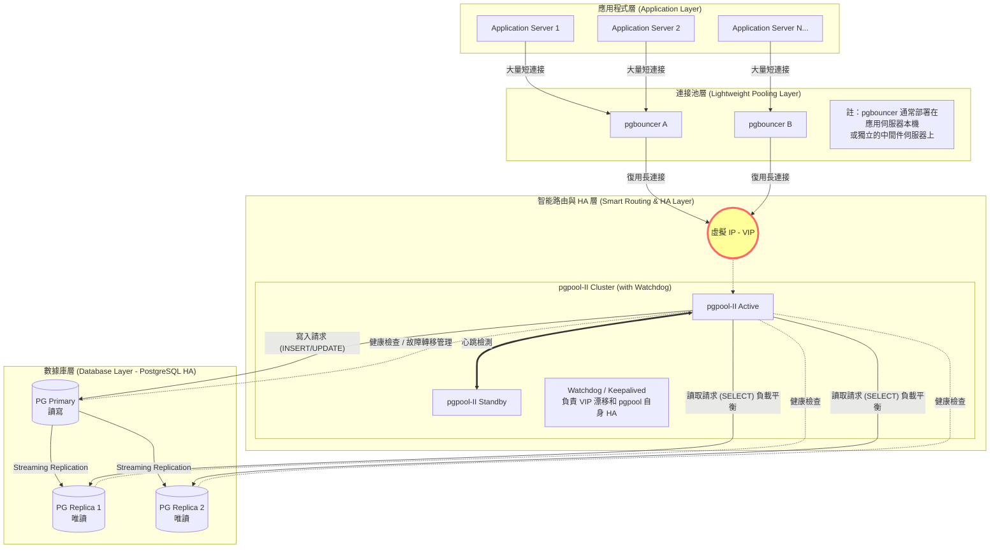

```mermaid
graph TB
    subgraph "應用程式層 (Application Layer)"
        App1[Application Server 1]
        App2[Application Server 2]
        AppN[Application Server N...]
    end

    subgraph "連接池層 (Lightweight Pooling Layer)"
        PB1[pgbouncer A]
        PB2[pgbouncer B]
        notePB[註：pgbouncer 通常部署在應用伺服器本機<br/>或獨立的中間件伺服器上]
    end

    subgraph "智能路由與 HA 層 (Smart Routing & HA Layer)"
        style VIP fill:#ff9,stroke:#f66,stroke-width:4px
        VIP((虛擬 IP - VIP))
        
        subgraph "pgpool-II Cluster (with Watchdog)"
            PP1[pgpool-II Active]
            PP2[pgpool-II Standby]
            Watchdog[Watchdog / Keepalived<br/>負責 VIP 漂移和 pgpool 自身 HA]
        end
    end

    subgraph "數據庫層 (Database Layer - PostgreSQL HA)"
        
        DB_Primary[(PG Primary<br/>讀寫)]
        DB_Replica1[(PG Replica 1<br/>唯讀)]
        DB_Replica2[(PG Replica 2<br/>唯讀)]
        
        DB_Primary -- Streaming Replication --> DB_Replica1
        DB_Primary -- Streaming Replication --> DB_Replica2
    end

    %% 連接流向
    App1 -- "大量短連接" --> PB1
    App2 -- "大量短連接" --> PB1
    AppN -- "大量短連接" --> PB2

    PB1 -- "復用長連接" --> VIP
    PB2 -- "復用長連接" --> VIP
    
    VIP -.-> PP1

    %% pgpool 的路由
    PP1 -- "寫入請求 (INSERT/UPDATE)" --> DB_Primary
    PP1 -- "讀取請求 (SELECT) 負載平衡" --> DB_Replica1
    PP1 -- "讀取請求 (SELECT) 負載平衡" --> DB_Replica2

    %% 監控線路
    PP1 -.-|健康檢查 / 故障轉移管理| DB_Primary
    PP1 -.-|健康檢查| DB_Replica1
    PP1 -.-|健康檢查| DB_Replica2

    %% Watchdog 內部通訊
    PP1 <==> |"心跳檢測"| PP2
```
